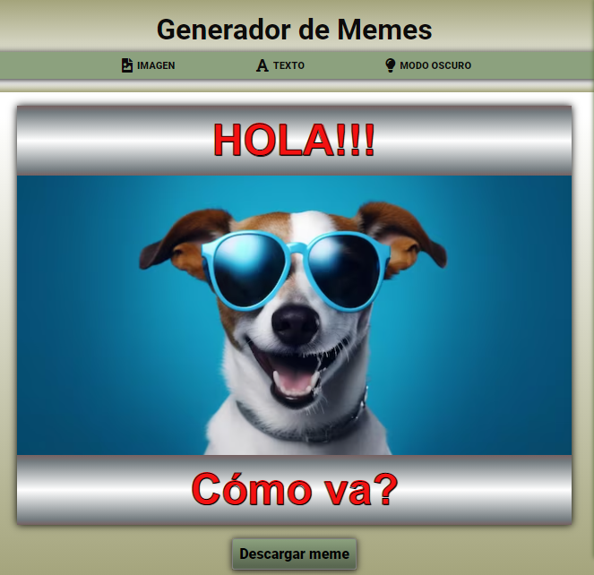
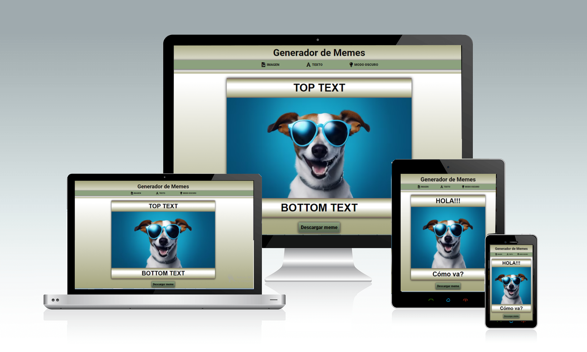
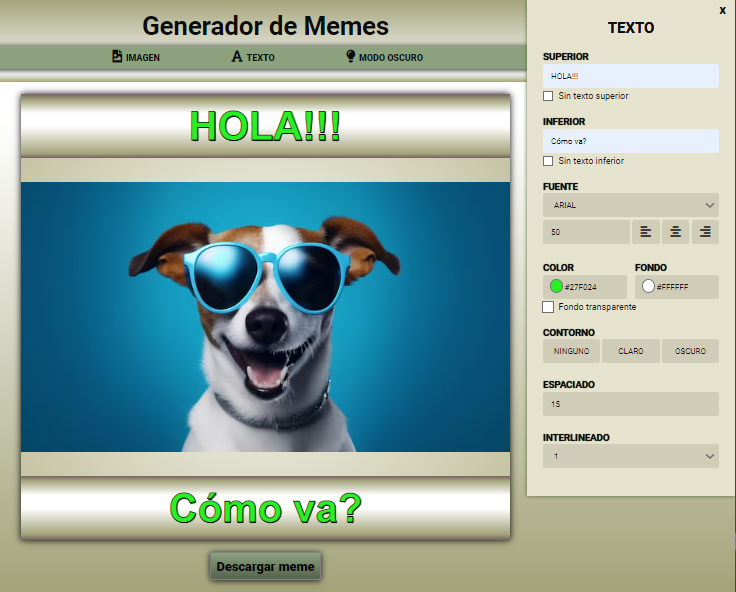
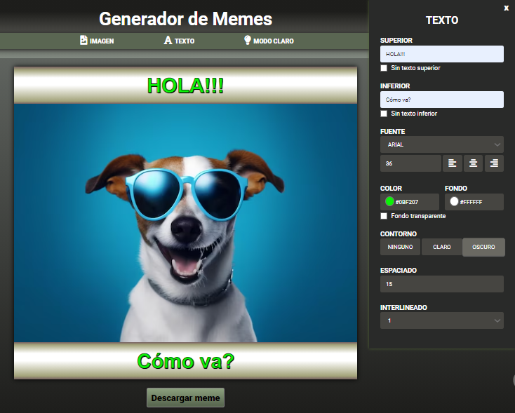
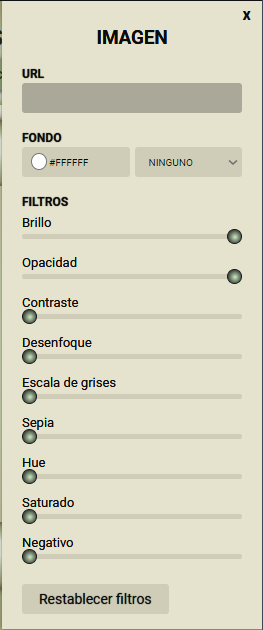
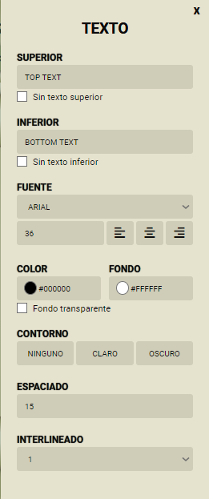

___
# ***Hola, soy Lucía Ferrer 👋!***
___

### Una apasionada de la programación Frontend   ♥
---
## Tecnologías que usé en mi proyecto
- HTML
- CSS
- JAVA SCRIPT
---

## Breve descripción del proyecto "Generador de Meme"
---
[MEME](#meme)
[Diseño responsive](#diseño-responsive)
[Apariencias] (#Modo)
[Posibilidad de alternar entre paneles de "Texto" e "Imagen".](#paneles-de-texto-e-imagen)
[Otros] ()
---
## Otros detalles del proyecto
- Posibilidad de navegación por teclado.
- Botón de descarga del MEME.

*** Funcionalidades del panel Imagen ***
- Agregar imagen con url
- Cambiar color de fondo
- Cambiar modo de mezcla de fondo con las opciones: "Aclarar", "Oscurecer", "Diferencia", "Luminosidad" y "Multiplicar"
- Posibilidad de cambio de filtros de imagen: "Brillo", "Opacidad", "Contraste", "Desenfoque", "Escala de gris", "Escala de sepia", "Hue", "Saturación" y "Negativo"
- Posibilidad de reestablecer la imagen (sin filtros aplicados).

*** Funcionalidades del panel Texto ***
- Editar y remover textos superior e inferior
- Cambiar familia de fuente
- Cambiar tamaño de fuente
- Cambiar alineación
- Cambiar color de texto
- Cambiar color de fondo de texto
- Fondo transparente
- Cambiar padding de texto
- Cambiar alto de línea de texto

---
[Explora mi proyecto en tu navegador](https://lucbea.github.io/Editor-de-meme/) ... 
### Espero que lo disfrutes, como lo hice yo cuando lo programé
---
---
### ***Imágenes de mi proyecto***
### Meme

[Volver](#breve-descripción-del-proyecto-generador-de-meme)
---
### Diseño responsive

[Volver](#breve-descripción-del-proyecto-generador-de-meme)
---
### Modo claro y Modo oscuro

[Volver](#breve-descripción-del-proyecto-generador-de-meme)
---
### Paneles de texto e imagen

[Volver](#breve-descripción-del-proyecto-generador-de-meme)
---

---
### ***¡Contactame!***
¿Te gusta lo que ves? ¡Me encantaría saber tu opinión! No dudes en escribirme... [ferrerlb@gmail.com](mailto:ferrerlb@gmail.com).

