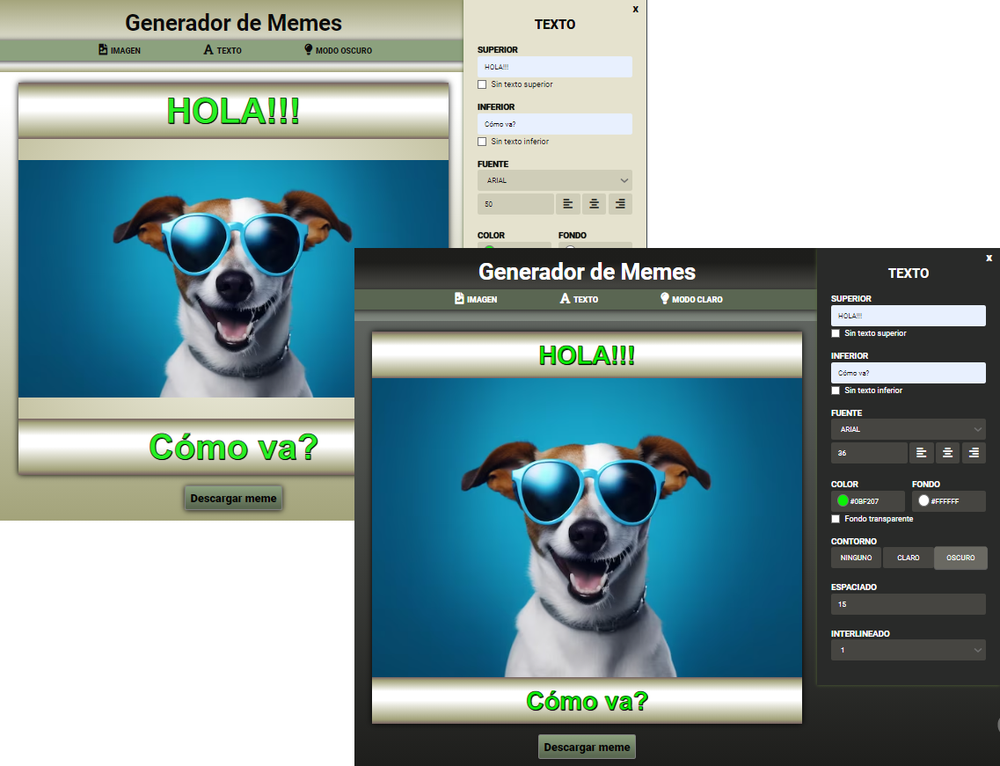
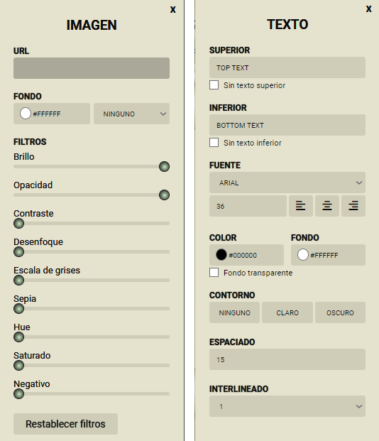

___
# ***Hola, soy Lucía Ferrer 👋!***
___

### Una apasionada de la programación Frontend   ♥
---
## Tecnologías que usé en mi proyecto
- HTML
- CSS
- JAVA SCRIPT
---

---
**# [Explora mi proyecto en tu navegador](https://lucbea.github.io/Editor-de-meme/)** 
### Espero que lo disfrutes, como lo hice yo cuando lo programé
---
---

## Breve descripción del proyecto "Generador de Meme"
---
#### - [MEME](#meme-1)
#### - [Responsive](#diseño-responsive)
#### - [Apariencias: modo claro y modo oscuro](#modo-claro-y-modo-oscuro)
#### - [Paneles de "Texto" e "Imagen".](#paneles-de-texto-e-imagen-1)
---
---
___
## Otros detalles del proyecto
- Posibilidad de navegación por teclado.
- Botón de descarga del MEME.

**Funcionalidades del panel Imagen**
- Agregar imagen con url
- Cambiar color de fondo
- Cambiar modo de mezcla de fondo con las opciones: "Aclarar", "Oscurecer", "Diferencia", "Luminosidad" y "Multiplicar"
- Posibilidad de cambio de filtros de imagen: "Brillo", "Opacidad", "Contraste", "Desenfoque", "Escala de gris", "Escala de sepia", "Hue", "Saturación" y "Negativo"
- Posibilidad de reestablecer la imagen (sin filtros aplicados).

**Funcionalidades del panel Texto**
- Editar y remover textos superior e inferior
- Cambiar familia de fuente
- Cambiar tamaño de fuente
- Cambiar alineación
- Cambiar color de texto
- Cambiar color de fondo de texto
- Fondo transparente
- Cambiar padding de texto
- Cambiar alto de línea de texto

---
### ***Imágenes de mi proyecto***
#### Meme

---
[Volver](#breve-descripción-del-proyecto-generador-de-meme)
---
#### Diseño responsive

---
[Volver](#breve-descripción-del-proyecto-generador-de-meme)
---
#### Modo claro y modo oscuro

---
[Volver](#breve-descripción-del-proyecto-generador-de-meme)
---
#### Paneles de texto e imagen

---
[Volver](#breve-descripción-del-proyecto-generador-de-meme)
---

---
### ***¡Contactame!***
¿Te gusta lo que ves? ¡Me encantaría saber tu opinión! No dudes en escribirme... [ferrerlb@gmail.com](mailto:ferrerlb@gmail.com).

